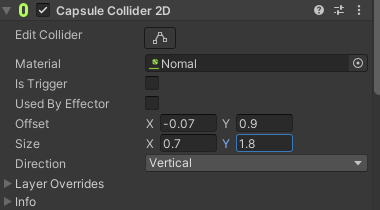
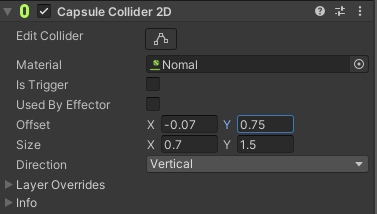

unity横版
第一关教程素材
第二关模仿奥日
开局 横版游戏内场景但是下雨打伞 点击雨伞开始游戏 雨停收伞

1. 中文名字：《旅途轮回》 英文名字： "Journey's Cycle"
2. 中文名字：《始终如一》 英文名字： "Eternal Return"
3. 中文名字：《时光往复》 英文名字： "Chrono Echoes"
4. 中文名字：《梦回起点》 英文名字： "Dreamback Adventure"
5. 中文名字：《回环奇旅》 英文名字： "Looped Odyssey"

彩蛋关卡 男主进入 发现在床上死了的自己终觉黄粱一梦 想做成3d的 看见之后选择这么做有没有意义没意义直接结束游戏有意义可以做后续

背刺伤害翻倍

Map Assets 

Tilemap瓦片地图>Palettes调色盘/Tiles瓦片

Scripts脚本

Settings>Physics Material物理材质

Animations动画和动画控制器

Input System 输入按键

功能：

1. 创建人物 pixels per unit 16->10
2. 创建地图used by composite
   1. 地图分层
   2. 瓦片地图
   3. 动态瓦片
   4. 规则瓦片
3. 人物物理
4. 人物胶囊型物理碰撞
   
5. 动画
   1. 行动
   2. 受伤
   3. 死亡
   4. 攻击
6. 人物控制输入 新输入系统
   1. 行走
   2. 跑步
   3. 转身
   4. 跳跃 检测是否在地面
   5. 下蹲 下蹲后更改胶囊碰撞体大小
      
7. 相机
   1. cinemachine插件
   2. 2d相机
   3. 死区
   4. 跟随位置
   5. 插件 
      1. cinemachine pixel perfect保证像素不会扭曲
      2. cinemachine confiner 2d 限制摄像机可以动的范围避免穿帮
      3. 摄像机震动

